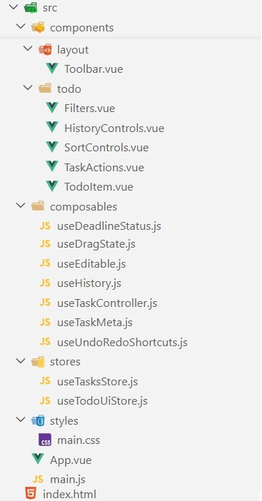

# 📌 Todo App

Приложение для управления задачами, реализованное на Vue 3 (Composition API).

Позволяет создавать, редактировать и отслеживать задачи,
работать с дедлайнами, фильтрацией, сортировкой и историей изменений (undo/redo).

---

---

## 🚀 Функциональность

- Добавление задач (кнопка + Enter)
- Задачи с дедлайном
- Редактирование по двойному клику
- Отметка выполнения (checkbox)
- Фильтрация:
  - Активные
  - Выполненные
  - Важные
  - Отложенные
- Сортировка:
  - По алфавиту
  - По статусу
  - По дедлайну
- Поиск задач
- Drag & Drop
- Undo / Redo
- Сохранение в localStorage
- Счётчик невыполненных задач

---

## ⌨️ Горячие клавиши

- Ctrl + Z — undo
- Ctrl + Y — redo

---

## 🛠 Технологии

- Vue 3 (Composition API)
- JavaScript (ES6+)
- Pinia
- CSS
- Vite

---

## ▶️ Запуск проекта

1. Установить зависимости:

```bash
npm install
```

2. Запустить проект:

```bash
   npm run dev
```

3. Открыть в браузере:

```
   http://localhost:5173
```

(порт может отличаться)

---

## 📸 Скриншот



---

## 🧠 Архитектура

**Stores**

- useTasksStore — задачи и история
- useUiStore — фильтры, поиск, сортировка

**Основные функции**

- addTask
- toggleTask
- deleteTask
- editTask
- updateTask
- undo / redo
- drag & drop

---

✨ Особенности

- Undo/redo без библиотек
- Drag & Drop реализован вручную
- Composition API
- Чистая архитектура
- LocalStorage

---

📌 Пример задачи
{
id: 1,
text: "Сделать зарядку",
done: false,
important: false,
deferred: false,
deadline: null
}

---

📌 Возможные улучшения
• Очистка всех задач
• Статистика
• Тесты
• Адаптив
• Сохранение настроек

---

👩‍💻 Автор
Учебный проект для изучения Vue 3
